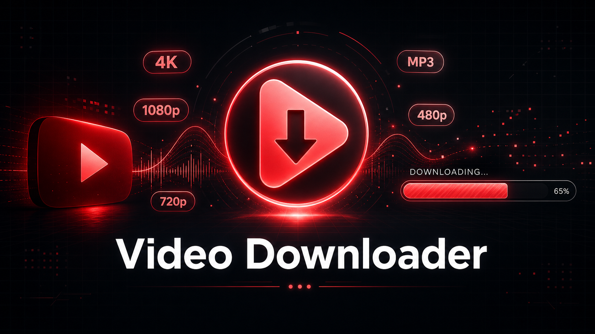

<div align="center">
  

  <br />
  <br />

  # ⬇️ Video Downloader

  **A clean, self-hosted web app to download YouTube videos with quality selection**

  <p align="center">
    
    
    
    
    
  </p>
</div>

---

> **Video Downloader** is a minimal self-hosted web app built on **FastAPI** + **yt-dlp**.  
> Paste a YouTube URL, pick your quality, and get the file — no ads, no tracking, no nonsense.

> ⚠️ **For personal/private use only.** Respect YouTube's ToS and your local copyright laws.

---

## ✨ Features

- 🎬 **Quality selector** — Best, 2160p, 1080p, 720p, 480p, 360p, or Audio-only MP3
- 📋 **Video preview** — Thumbnail, title, uploader, duration, and view count before downloading
- ⏳ **Live progress bar** — Real-time download + merge progress via background jobs
- 🔒 **Safe by design** — Uses `yt-dlp` Python API (no raw shell), 2 GB file cap, no playlists
- ⚡ **Zero dependencies** beyond Python, `ffmpeg`, and pip packages
- 🌐 **Pure HTML/CSS/JS frontend** — No framework, no build step

---

## 📋 Requirements

| Requirement | Version |
|-------------|---------|
| Python | `3.10+` |
| ffmpeg | Any recent build |
| Node.js | Optional (improves yt-dlp JS extraction) |

> 💡 **ffmpeg** is needed to merge separate video + audio streams (any quality above `360p` on YouTube typically needs it).

---

## 🚀 Setup & Installation

### 1. Clone & enter

```bash
git clone https://github.com/miguelcc06/video-downloader.git
cd video-downloader
```

### 2. Create virtual environment

```bash
python3 -m venv .venv
source .venv/bin/activate       # Windows: .venv\Scripts\activate
```

### 3. Install dependencies

```bash
pip install -r requirements.txt
```

### 4. Configure (optional)

```bash
cp .env.example .env
# Edit .env if you want to change HOST, PORT, or MAX_FILESIZE_BYTES
```

### 5. Run

```bash
uvicorn app.main:app --host 0.0.0.0 --port 8080 --reload
```

> 📍 Open `http://localhost:8080` in your browser.

---

## 🗂️ Project Structure

```
video-downloader/
├── app/
│   └── main.py          # FastAPI backend — all logic lives here
├── static/
│   ├── index.html       # Single-page frontend
│   ├── css/style.css    # Dark-theme styles
│   └── js/app.js        # Vanilla JS — fetch info, start job, poll progress
├── downloads/           # Output files (git-ignored)
├── assets/
│   └── banner.png       # README banner
├── .env.example         # Environment template
├── .gitignore
├── requirements.txt
└── README.md
```

---

## 🔌 API Reference

| Method | Endpoint | Description |
|--------|----------|-------------|
| `GET` | `/` | Web UI |
| `POST` | `/api/info` | Fetch video metadata + available qualities |
| `POST` | `/api/download` | Start a background download job |
| `GET` | `/api/jobs/{id}` | Poll job status and progress |
| `GET` | `/api/jobs/{id}/file` | Download the finished file |

### Example: fetch info

```bash
curl -s -X POST http://localhost:8080/api/info \
  -H "Content-Type: application/json" \
  -d '{"url": "https://www.youtube.com/watch?v=dQw4w9WgXcQ"}' | jq .
```

```json
{
  "title": "Rick Astley - Never Gonna Give You Up",
  "thumbnail": "https://...",
  "duration": 213,
  "uploader": "Rick Astley",
  "view_count": 1400000000,
  "available_qualities": ["best", "1080p", "720p", "480p", "360p", "audio_only"]
}
```

### Quality presets

| Key | Format string |
|-----|---------------|
| `best` | `bestvideo+bestaudio/best` |
| `1080p` | `bestvideo[height<=1080]+bestaudio/best[height<=1080]` |
| `720p` | `bestvideo[height<=720]+bestaudio/best[height<=720]` |
| `audio_only` | `bestaudio/best` → re-encoded as MP3 192kbps |

---

## 🛡️ Guardrails

The app includes sensible defaults so it doesn't eat your disk alive:

- **2 GB max file size** (configurable via `MAX_FILESIZE_BYTES` in `.env`)
- **Playlists disabled** — single videos only
- **No cookies** — clean session, no account token leakage
- **Background jobs** — downloads don't block the web server
- **In-memory job store** — jobs live only for the current process session

---

## 🔧 Production Tips

If you want to expose this beyond localhost:

1. **Add auth** — at minimum an HTTP Basic Auth middleware or Cloudflare Access in front
2. **Scheduled cleanup** — add a cron to `rm -rf downloads/*` daily
3. **Job persistence** — swap the in-memory dict for Redis or SQLite for multi-process deploys
4. **Rate limiting** — `slowapi` integrates cleanly with FastAPI

---

<div align="center">
  <i>Built for personal use. Keep it private, keep it fast.</i><br>
  <b>License: MIT</b>
</div>
